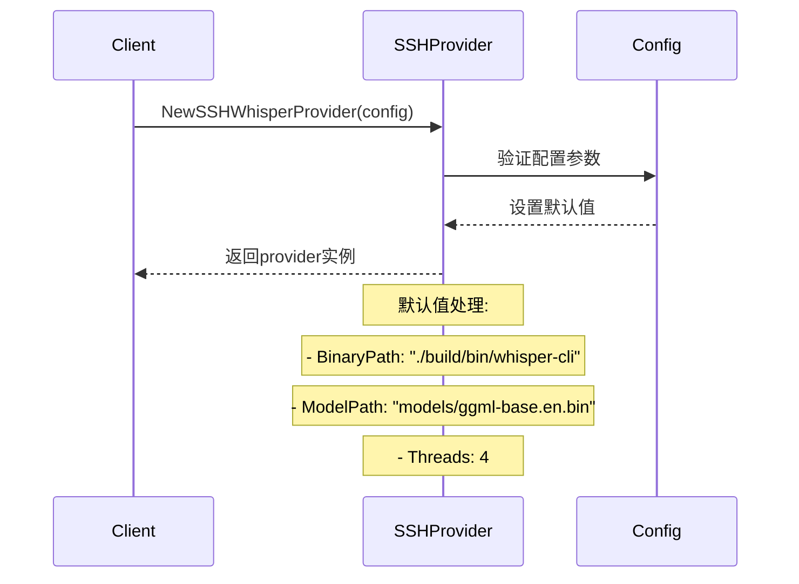
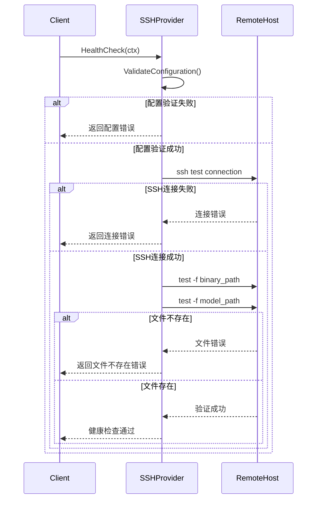
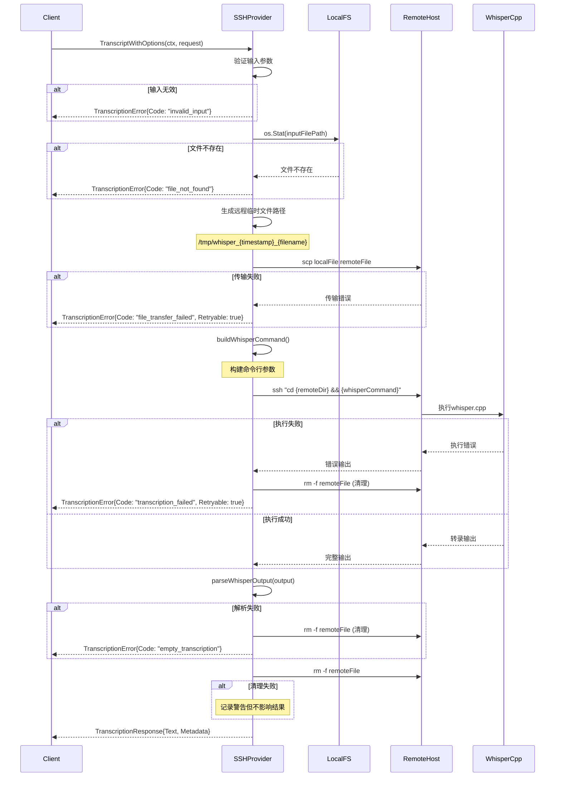
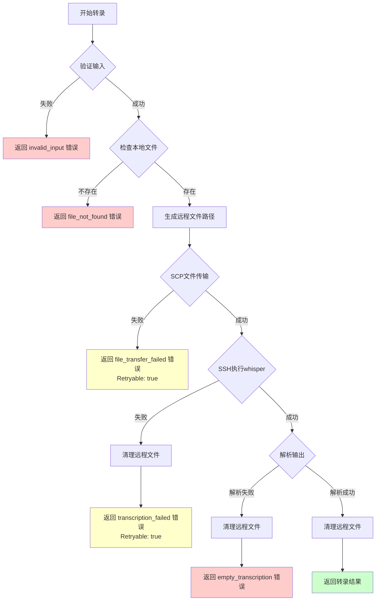

# SSH Whisper Provider 文档

## 概述

SSH Whisper Provider 是一个通过SSH连接远程whisper.cpp实例进行音频转录的provider，它能够将本地音频文件传输到远程服务器，执行转录，并返回结果。这种架构特别适合以下场景：

- 本地计算资源有限，需要使用远程高性能设备
- 需要使用特定硬件加速（如Apple Silicon的CoreML）
- 集中化转录服务管理
- 负载均衡和横向扩展

## 架构设计

### 核心组件

```
┌─────────────────┐    SSH/SCP    ┌─────────────────┐
│   Local Client  │◄─────────────►│  Remote Server  │
│                 │               │                 │
│ ┌─────────────┐ │               │ ┌─────────────┐ │
│ │ SSH Whisper │ │               │ │ whisper.cpp │ │
│ │  Provider   │ │               │ │   Binary    │ │
│ └─────────────┘ │               │ └─────────────┘ │
│                 │               │                 │
│ ┌─────────────┐ │               │ ┌─────────────┐ │
│ │ Audio File  │ │    scp copy   │ │ Temp Audio  │ │
│ │  (Local)    │ │──────────────►│ │   File      │ │
│ └─────────────┘ │               │ └─────────────┘ │
└─────────────────┘               └─────────────────┘
```

### 核心文件结构

```
internal/app/api/ssh_whisper/
├── ssh_provider.go      # 主要实现文件
├── simple_test.go       # 单元测试
└── README.md           # 使用说明

cmd/test-ssh-simple/
└── main.go             # 集成测试工具

providers-ssh-example.yaml  # 配置示例
```

## 数据流转详细说明

### 1. 初始化阶段



### 2. 健康检查流程



### 3. 转录流程核心数据流



### 4. 错误处理流程



## 配置说明

### 基础配置结构

```go
type SSHWhisperConfig struct {
    Host       string `yaml:"host"`        // SSH主机 (user@hostname)
    RemoteDir  string `yaml:"remote_dir"`  // 远程whisper.cpp目录
    BinaryPath string `yaml:"binary_path"` // 远程二进制路径
    ModelPath  string `yaml:"model_path"`  // 远程模型路径
    Language   string `yaml:"language"`    // 语言代码
    Prompt     string `yaml:"prompt"`      // 转录提示
    Threads    int    `yaml:"threads"`     // 线程数
}
```

### 完整YAML配置示例

```yaml
default_provider: "ssh_whisper"

providers:
  ssh_whisper:
    type: "ssh_whisper"
    enabled: true
    settings:
      host: "daymade@mac-mini-m4-1.local"
      remote_dir: "/Users/daymade/Workspace/cpp/whisper.cpp"
      binary_path: "./build/bin/whisper-cli"
      model_path: "models/ggml-base.en.bin"
      language: "en"
      prompt: "This is a clear English speech."
      threads: 4
    performance:
      timeout_sec: 120
      max_concurrency: 1
    error_handling:
      max_retries: 2
      retry_delay_ms: 2000

  ssh_whisper_chinese:
    type: "ssh_whisper"
    enabled: true
    settings:
      host: "daymade@mac-mini-m4-1.local"
      remote_dir: "/Users/daymade/Workspace/cpp/whisper.cpp"
      binary_path: "./build/bin/whisper-cli"
      model_path: "models/ggml-large-v3.bin"
      language: "zh"
      prompt: "以下是简体中文普通话:"
      threads: 6
    performance:
      timeout_sec: 300
      max_concurrency: 1
```

## 性能特征

### 延迟组成分析

```
总延迟 = 文件传输时间 + 远程处理时间 + 网络往返时间

┌─────────────────────────────────────────────────────────┐
│                    总处理时间                             │
├──────────┬─────────────────────────┬──────────────────────┤
│文件传输   │      远程whisper处理     │   结果传输 + 清理     │
│(scp)     │                        │                     │
│~100-500ms│        ~500-5000ms      │      ~50-100ms      │
└──────────┴─────────────────────────┴──────────────────────┘
```

### 性能优化建议

1. **网络优化**
   - 使用SSH密钥认证（避免密码输入延迟）
   - 启用SSH连接复用 (`ControlMaster`)
   - 考虑压缩传输 (`scp -C`)

2. **远程资源优化**
   - 选择合适的线程数（通常等于CPU核心数）
   - 使用SSD存储临时文件
   - 启用硬件加速（如CoreML）

3. **批量处理优化**
   - 实现连接池复用
   - 批量传输多个文件
   - 异步并发处理

## 使用示例

### 1. 基本使用

```go
// 创建配置
config := ssh_whisper.SSHWhisperConfig{
    Host:       "user@remote-server",
    RemoteDir:  "/path/to/whisper.cpp",
    BinaryPath: "./build/bin/whisper-cli",
    ModelPath:  "models/ggml-base.en.bin",
    Language:   "en",
    Threads:    4,
}

// 创建provider
provider := ssh_whisper.NewSSHWhisperProvider(config)

// 健康检查
ctx := context.Background()
if err := provider.HealthCheck(ctx); err != nil {
    log.Fatal("Health check failed:", err)
}

// 转录音频
result, err := provider.Transcript("/path/to/audio.wav")
if err != nil {
    log.Fatal("Transcription failed:", err)
}

fmt.Println("Transcription:", result)
```

### 2. 高级配置使用

```go
// 从配置文件创建
settings := map[string]interface{}{
    "host":        "user@remote-server",
    "remote_dir":  "/path/to/whisper.cpp",
    "binary_path": "./build/bin/whisper-cli",
    "model_path":  "models/ggml-large-v3.bin",
    "language":    "zh",
    "prompt":      "以下是简体中文普通话:",
    "threads":     8,
}

provider, err := ssh_whisper.NewSSHWhisperProviderFromSettings(settings)
if err != nil {
    log.Fatal("Failed to create provider:", err)
}

// 使用增强接口
request := &provider.TranscriptionRequest{
    InputFilePath: "/path/to/chinese_audio.wav",
    Language:      "zh",
    Prompt:        "这是一段重要的会议录音",
}

ctx, cancel := context.WithTimeout(context.Background(), 5*time.Minute)
defer cancel()

response, err := provider.TranscriptWithOptions(ctx, request)
if err != nil {
    log.Fatal("Enhanced transcription failed:", err)
}

fmt.Printf("Text: %s\n", response.Text)
fmt.Printf("Language: %s\n", response.Language)
fmt.Printf("Processing Time: %v\n", response.ProcessingTime)
fmt.Printf("Model Used: %s\n", response.ModelUsed)
```

### 3. CLI使用

```bash
# 使用providers命令管理SSH provider
v2t providers list
v2t providers info ssh_whisper
v2t providers test ssh_whisper --file test.wav

# 使用convert命令进行转录
v2t convert --audio --input audio.wav --provider ssh_whisper
```

## 故障排除

### 常见错误及解决方案

#### 1. SSH连接失败

**错误**: `SSH connection test failed: Permission denied`

**解决方案**:
```bash
# 检查SSH密钥
ssh-add -l

# 添加SSH密钥
ssh-add ~/.ssh/id_rsa

# 测试SSH连接
ssh user@remote-server "echo 'Connection test'"

# 配置SSH客户端
cat >> ~/.ssh/config << EOF
Host remote-server
    HostName remote-server.example.com
    User username
    IdentityFile ~/.ssh/id_rsa
    ControlMaster auto
    ControlPath ~/.ssh/master-%r@%h:%p
EOF
```

#### 2. 远程文件不存在

**错误**: `remote binary not found: /path/to/whisper-cli`

**解决方案**:
```bash
# 登录远程服务器检查
ssh user@remote-server

# 检查whisper.cpp目录和文件
ls -la /path/to/whisper.cpp/
ls -la /path/to/whisper.cpp/build/bin/
ls -la /path/to/whisper.cpp/models/

# 编译whisper.cpp（如需要）
cd /path/to/whisper.cpp
make clean
make -j
```

#### 3. 模型文件缺失

**错误**: `remote model not found: models/ggml-base.en.bin`

**解决方案**:
```bash
# 下载模型文件
cd /path/to/whisper.cpp
bash ./models/download-ggml-model.sh base.en
bash ./models/download-ggml-model.sh large-v3

# 验证模型文件
ls -la models/ggml-*.bin
```

#### 4. 权限问题

**错误**: `scp failed: Permission denied`

**解决方案**:
```bash
# 检查临时目录权限
ssh user@remote-server "ls -la /tmp/"

# 创建临时目录（如需要）
ssh user@remote-server "mkdir -p /tmp/whisper && chmod 755 /tmp/whisper"

# 检查用户权限
ssh user@remote-server "id && groups"
```

### 性能调优

#### 网络优化

```bash
# SSH配置优化
cat >> ~/.ssh/config << EOF
Host *
    Compression yes
    CompressionLevel 6
    ControlMaster auto
    ControlPath ~/.ssh/master-%r@%h:%p
    ControlPersist 10m
EOF
```

#### 远程优化

```bash
# 检查远程系统资源
ssh user@remote-server "top -n 1"
ssh user@remote-server "df -h"
ssh user@remote-server "free -h"

# 优化whisper.cpp编译
ssh user@remote-server "cd /path/to/whisper.cpp && make clean && WHISPER_COREML=1 make -j"
```

## 监控和日志

### 关键指标

1. **连接指标**
   - SSH连接成功率
   - 平均连接时间
   - 连接失败原因分布

2. **传输指标**
   - 文件传输速度 (MB/s)
   - 传输成功率
   - 传输时间分布

3. **处理指标**
   - 转录成功率
   - 平均处理时间
   - 错误类型分布

### 日志示例

```
2025-08-02 18:45:12 INFO [ssh_whisper] Starting transcription for file: audio.wav
2025-08-02 18:45:12 INFO [ssh_whisper] Copying file to remote: /tmp/whisper_1722628512_audio.wav
2025-08-02 18:45:13 INFO [ssh_whisper] File transfer completed (1.2MB in 847ms)
2025-08-02 18:45:13 INFO [ssh_whisper] Executing remote command: ./build/bin/whisper-cli -m models/ggml-base.en.bin -f /tmp/whisper_1722628512_audio.wav -nt -t 4
2025-08-02 18:45:15 INFO [ssh_whisper] Remote execution completed (1.8s)
2025-08-02 18:45:15 INFO [ssh_whisper] Transcription result: "Hello, this is a test audio file."
2025-08-02 18:45:15 INFO [ssh_whisper] Cleaning up remote file
2025-08-02 18:45:15 INFO [ssh_whisper] Transcription completed successfully (total: 3.2s)
```

## 安全考虑

### 1. SSH安全

- 使用SSH密钥认证，禁用密码认证
- 限制SSH访问IP范围
- 定期轮换SSH密钥
- 使用SSH跳板机（如需要）

### 2. 文件安全

- 临时文件使用随机文件名
- 处理完成后立即删除临时文件
- 限制临时文件目录权限
- 不在日志中记录敏感音频内容

### 3. 网络安全

- 使用VPN或专线连接
- 启用SSH连接加密
- 监控异常连接和传输

## 扩展和定制

### 自定义命令构建

可以继承`SSHWhisperProvider`并重写`buildWhisperCommand`方法：

```go
type CustomSSHProvider struct {
    *ssh_whisper.SSHWhisperProvider
}

func (csp *CustomSSHProvider) buildWhisperCommand(remoteFilePath string, request *provider.TranscriptionRequest) string {
    // 自定义命令构建逻辑
    args := []string{
        csp.config.BinaryPath,
        "-m", csp.config.ModelPath,
        "-f", remoteFilePath,
        "--custom-flag", "value",
    }
    return strings.Join(args, " ")
}
```

### 添加新的错误类型

```go
// 在处理逻辑中添加新的错误类型
if customErrorCondition {
    return nil, &provider.TranscriptionError{
        Code:      "custom_error_code",
        Message:   "Custom error description",
        Provider:  "ssh_whisper",
        Retryable: true,
        Suggestions: []string{"Try custom solution"},
    }
}
```

### 支持多远程主机负载均衡

可以创建一个管理多个SSH provider实例的包装器，实现负载均衡和故障转移。

---

这份文档详细说明了SSH Whisper Provider的架构、数据流转、配置、使用方法和故障排除。如果需要更具体的某个部分的说明，请告诉我。